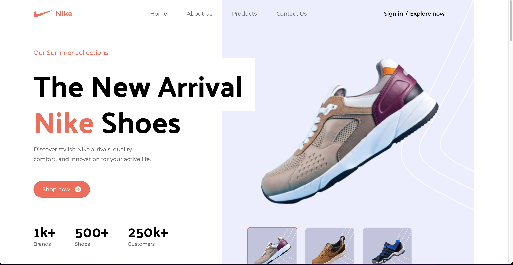
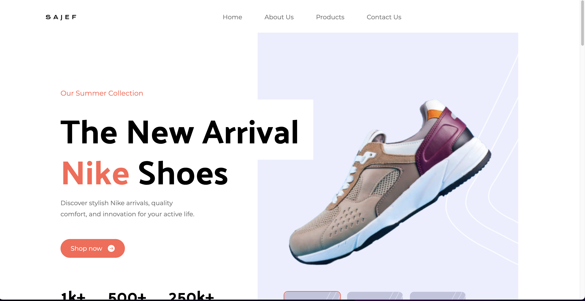

# React + Vite

# Project Name

Brief project description here.

## Table of Contents

- [Introduction](#introduction)
- [Features](#features)
- [Installation](#installation)
- [Usage](#usage)
- [Screenshots](#screenshots)
- [MobileScreenshots](#mobilescreenshots)
- [Contributing](#contributing)
- [License](#license)
- [OriginalLink](#originallink)
- [ClonedLink](#clonedlink)

## Introduction

Brief introduction to your project.

## Features

List of key features.

## Installation

Installation instructions.

## Usage

How to use your project.

## Screenshots

<!-- Side-by-side images -->

    
    

## MobileScreenshots

<!-- Side-by-side images -->

    
    

## Contributing

Guidelines for contributing to the project.

## OriginalLink

Real Project.
 <a href="https://nike-rosy.vercel.app/">Original Url</a>

## ClonedLink

Cloned Project.
 <a href="sajef.vercel.app">Cloned Url</a>
